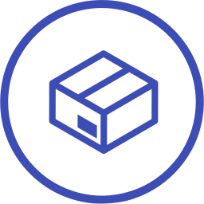

# Package
By [Arthur Schmitt](https://thenounproject.com/tart2000), from the [Noun Project](https://thenounproject.com/term/package/18159/)

The project icon is pulled from 'TheNounProject', and adapted into the flat-circle icon approach.

The icon has been altered for the purposes of a project icon.

---
|||
|---|---|
|**Title**|Package|
|**Author**|[Arthur Schmitt](https://thenounproject.com/tart2000)|
|**Source**|https://thenounproject.com/term/package/18159/|
|**License**|Public Domain|
|**Tags**|Package, Shopping, Online, Mail, Isometric, Delivery Man, Delivery, Buy, Box, Amazon, Address, Simple|

---